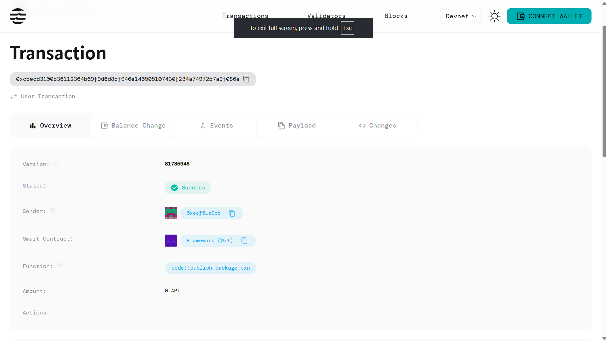

# Decentralized Oracle Network

## Project Description

The Decentralized Oracle Network is a blockchain-based solution that creates networks of independent oracle providers to supply reliable, real-world data to smart contracts. This system enables multiple oracle providers to contribute data feeds, stake tokens for credibility, and build reputation scores based on the accuracy and consistency of their data submissions.

The network eliminates single points of failure by distributing data sourcing across multiple independent providers, ensuring that smart contracts have access to trustworthy, tamper-resistant external data sources.

## Project Vision

Our vision is to build a robust, decentralized infrastructure that bridges the gap between blockchain applications and real-world data. We aim to create a trustless environment where:

- **Data Integrity**: Multiple independent sources provide cross-verified information
- **Economic Incentives**: Oracle providers are rewarded for accurate data and penalized for malicious behavior
- **Scalability**: The network can support unlimited oracle providers and data feeds
- **Transparency**: All data submissions and provider activities are recorded on-chain
- **Accessibility**: Any qualified provider can join the network and contribute valuable data

## Key Features

### 🔐 **Stake-Based Registration**
- Oracle providers must stake tokens to participate in the network
- Minimum stake requirements ensure commitment and skin in the game
- Staked tokens act as collateral against malicious behavior

### 📊 **Reputation System**
- Providers build reputation scores based on data accuracy and consistency
- Higher reputation scores lead to greater influence in data aggregation
- Transparent scoring mechanism encourages honest participation

### 📈 **Multi-Provider Data Feeds**
- Multiple oracle providers can submit data for the same feed
- Aggregation mechanisms combine multiple inputs for enhanced reliability
- Timestamp tracking ensures data freshness and chronological accuracy

### ⚡ **Real-Time Updates**
- Providers can submit new data feeds at any time
- Automatic tracking of submission frequency and provider activity
- Dynamic stake weighting based on provider participation

### 🛡️ **Built-in Security**
- Smart contract verification of provider status and stake requirements
- On-chain validation of all data submissions
- Economic disincentives for providing false or manipulated data

## Future Scope

### Phase 1: Core Network Enhancement
- **Data Validation Algorithms**: Implement advanced consensus mechanisms for data accuracy
- **Slashing Mechanisms**: Automatic penalty system for providers submitting incorrect data
- **Reward Distribution**: Token rewards for consistent, accurate data providers

### Phase 2: Advanced Features
- **Data Categories**: Support for different types of data feeds (price, weather, sports, etc.)
- **Subscription Models**: Allow smart contracts to subscribe to specific data feeds
- **Dispute Resolution**: Decentralized arbitration system for data conflicts

### Phase 3: Ecosystem Expansion
- **Cross-Chain Integration**: Support for multiple blockchain networks
- **API Gateway**: Easy integration tools for developers and applications
- **Governance Token**: Community-driven decision making for network parameters

### Phase 4: Enterprise Solutions
- **Private Oracle Networks**: Customizable networks for enterprise clients
- **SLA Guarantees**: Service level agreements with guaranteed data delivery
- **Compliance Tools**: Built-in features for regulatory compliance and reporting

### Long-term Vision
- **AI Integration**: Machine learning algorithms for data quality assessment
- **IoT Connectivity**: Direct integration with Internet of Things devices
- **Global Data Marketplace**: Comprehensive platform for all types of external data needs

## Contract Details

0xcbecd3100d36112364b69f9d6d8df946e146505107430f234a74972b7a9f086e
